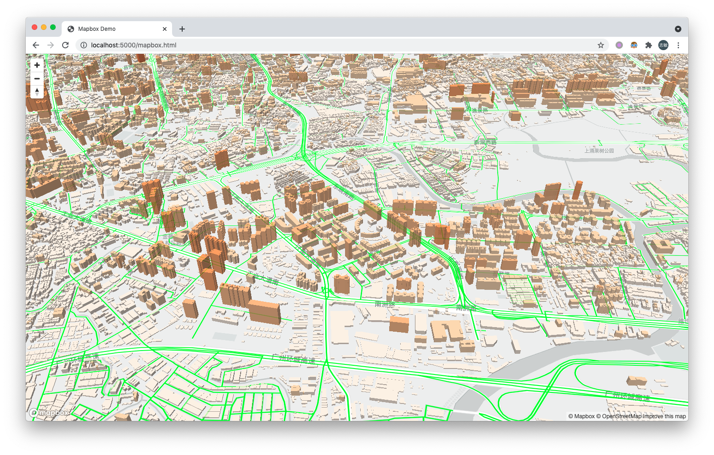

# 实时矢量切片服务器

VectorTile 是一个基于 [PostGIS](http://postgis.net/) 的 [ST_AsMVT](http://postgis.net/docs/ST_AsMVT.html) 函数开发的矢量切片服务器， HTTP 请求处理基于 .Net 6 WebAPI 实现。



## 数据库需求

- PostGIS 最新版， 目前是 3.1.2 ；
- PostgreSQL 虽然 PostGIS 最低支持 9.6.x 版本的， 但是建议使用最新版 12.x 或者 13.x 以获取最佳的性能；

如果有 Docker 环境， 可以直接拉取我定制的 [PostGIS](https://hub.docker.com/r/beginor/postgis) 镜像：

```sh
docker pull beginor/postgis:13
```

也可以拉取 PostGIS 的官方镜像：

```sh
docker pull postgis/postgis:13-3.1
```

当然， 也可以自行安装 PostgreSQL + PostGIS 。

## 空间数据要求

空间数据格式没有要求， 只要能使用 GIS 软件 (QGIS, GDAL, ArcGIS 等) 导入到数据库中即可。

空间数据的坐标系建议是 WGS84 Web Mercator (SRID 3857) ， 这个是 WebGIS 的标准， 也是矢量切片服务的默认坐标系， 输出时不需要进行坐标系转换， 效率最高。

虽然 PostGIS 提供了 [ST_Transform](http://postgis.net/docs/ST_Transform.html) 函数可以进行坐标系转换， 但是却要消耗额外的性能 (v1.1.0 提供了缓存功能， 在缓存有效时间内， 只需要进行一次坐标系转换）。

## 配置说明

矢量切片服务配置保存在 `config` 目录下的 `appsettings.json` 文件中， 配置项说明如下：

```jsonc
{
  "logging": { }, // 默认的日志输出， 不用修改
  "allowedHosts": "*", // 允许的主机名， 不用修改
  "connectionStrings": { // 数据库连接， 必须根据自己的需要进行修改
    // 数据库链接示例
    "test_db": "server=127.0.0.1;port=5432;database=test_db;user id=postgres;password=YOUR_PASS",
    // 可以添加多个数据库连接
    "test_db2": ""
  },
  "cache": { // 全局缓存设置
    "enabled": true, // 启用缓存
    "directory": "./app_cache", // 缓存目录
    "duration": 86400 // 默认的缓存时间， 以秒为单位， 1 天 3600 * 24 = 86400 秒
  },
  "vectors": {
    "test1": { // 配置一个矢量切片源
      "connectionString": "test_db", // 上面配置数据库连接串， 也可以直接写数据库链接
      "cacheDuration": 3600, // 该矢量切片源的缓存时间，如果未设置则使用全局默认的缓存时间
      "layers": [
        {
          "name": "road", // 图层名称
          "minzoom": 9, // 最小缩放级别
          "maxzoom": 15, // 最大缩放级别
          "schema": "public", // 数据表所在的架构 
          "tableName": "sr3857_road", // 图层对应的数据表名称
          "idColumn": "id", // 图层的ID字段， 每一行对应一个唯一的整数，
          "attributeColumns": "name, fclass, ref, oneway, maxspeed, bridge, tunnel, layer", // 要输出的属性字段， 不要填 * ， 请合理选择要输出的字段。
          "geometryColumn": "geom", // 空间坐标字段
          "srid": 3857 // 图层保存的坐标系， 如果 srid 不是 3857 ， 将会调用 ST_Transform 实时转换
        },
        {
          "name": "building", // 另一个图层， 和上面的类似
          "minzoom": 13,
          "maxzoom": 17,
          "schema": "public",
          "tableName": "sr3857_building",
          "idColumn": "objectid",
          "attributeColumns": "name, height, flag, type, area_id",
          "geometryColumn": "geom",
          "srid": 3857
        }
      ]
    },
    "test2": { /* 可以配置多个矢量切片源 */}
  }
}
```

## 运行

Windows 系统直接运行 run.bat ， Linux 系统直接运行 run.sh ， 默认测试页面地址是：

- <http://localhost:5000/vector/mapbox.html>
- <http://localhost:5000/vector/arcgis.html>

> 如果需要修改占用的端口和上下文， 请修改 run.bat 或者 run.sh 文件内的 `ASPNETCORE_PATHBASE` 以及 `ASPNETCORE_URLS` 。
